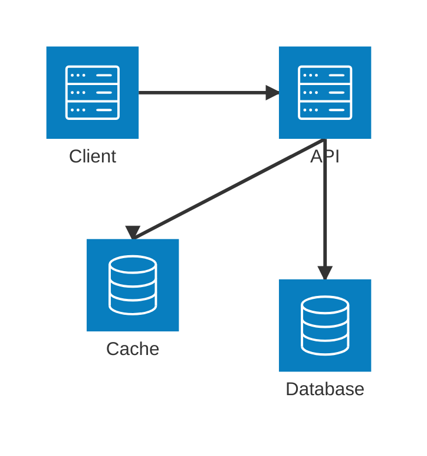
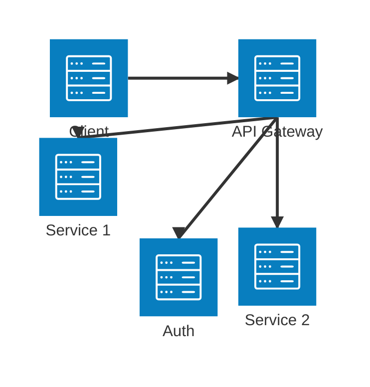
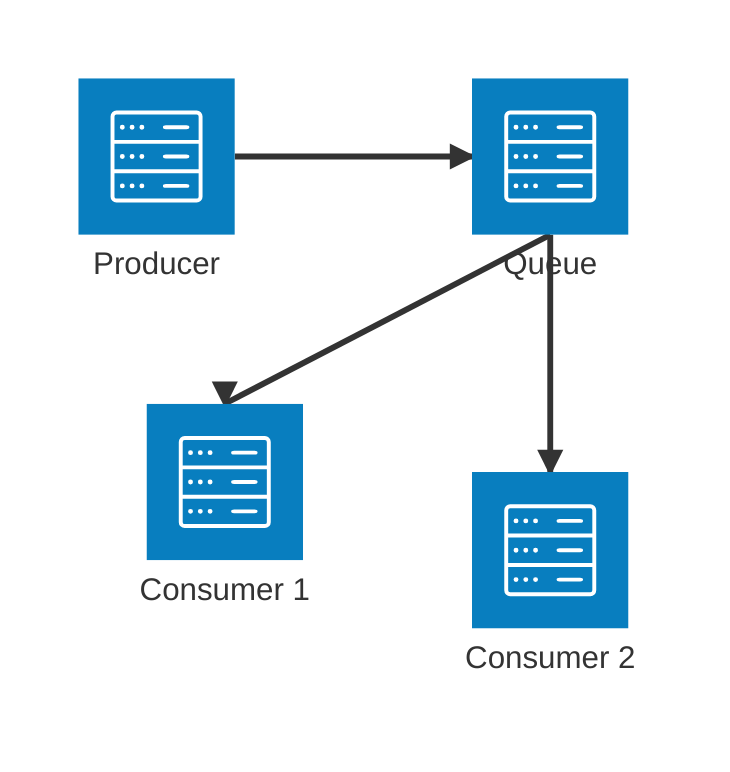

# Architecture Best Practices

## Design Principles

### 1. Separation of Concerns
- Separate different functional areas into distinct groups
- Use clear boundaries between components
- Maintain logical grouping of related services

Example:

### 2. High Availability
- Include redundant components
- Implement load balancing
- Design for fault tolerance

Example:

## Component Organization

### 1. Logical Grouping
- Group components by function
- Use meaningful group names
- Maintain clear hierarchy

### 2. Connection Patterns
- Minimize crossing lines
- Use consistent direction for flows
- Show clear data/request paths

### 3. Scaling Considerations
- Show scalable components
- Indicate replication
- Mark high-availability components

## Security Considerations

### 1. Network Segmentation

### 2. Access Controls
- Show security boundaries
- Indicate authentication points
- Mark secure connections

## Performance Optimization

### 1. Caching Strategy

### 2. Load Distribution
- Show load balancers
- Indicate traffic distribution
- Mark scaling groups

## Documentation Guidelines

### 1. Diagram Clarity
- Use clear, descriptive labels
- Include legend when needed
- Add relevant comments

### 2. Versioning
- Mark version numbers
- Show deployment stages
- Indicate dependencies

### 3. Maintenance
- Keep diagrams up to date
- Document changes
- Review periodically

## Common Patterns

### 1. API Gateway Pattern

### 2. Event-Driven Pattern

### 3. Microservices Pattern
