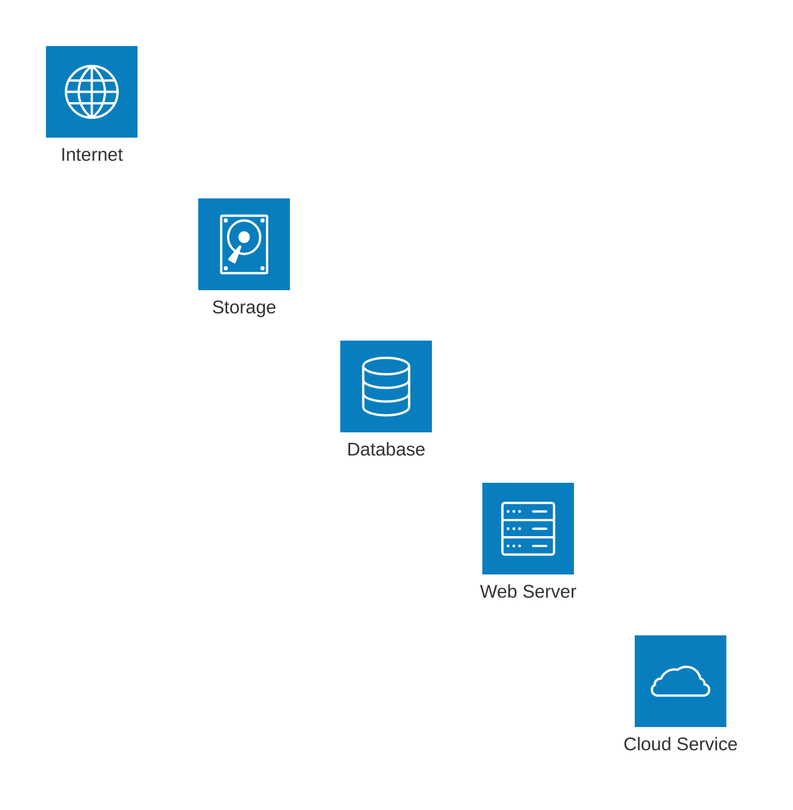
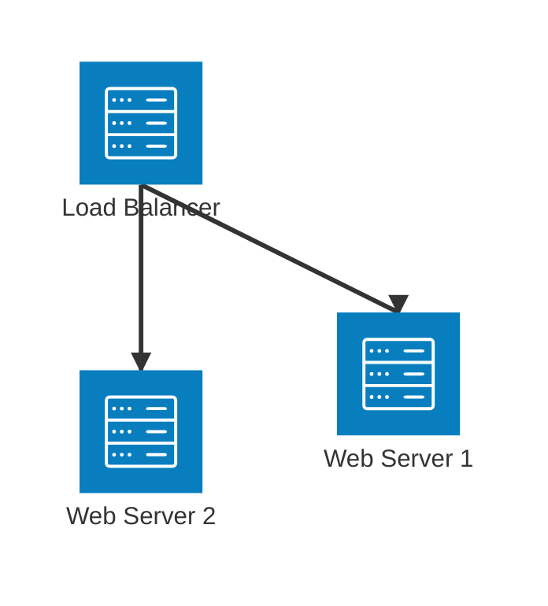
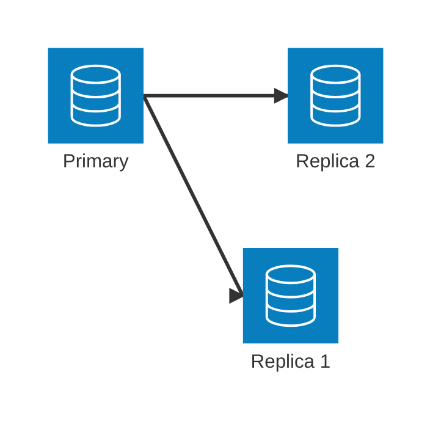
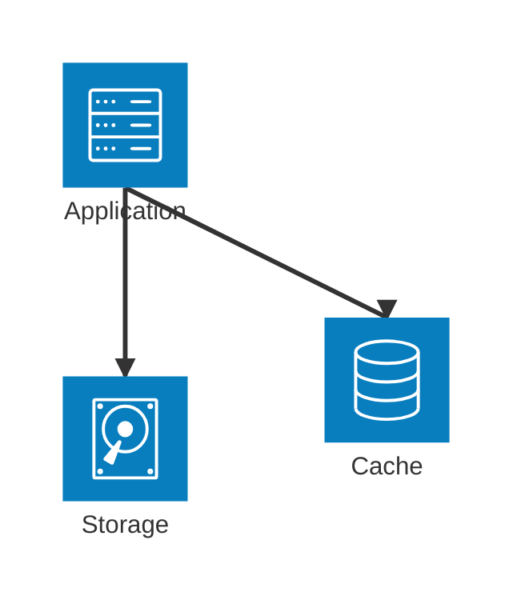

# Mermaid Architecture Icons Reference

## Built-in Icons

### Infrastructure Icons
- `(cloud)` - Cloud or group container
- `(server)` - Server or service
- `(database)` - Database
- `(disk)` - Storage
- `(internet)` - Internet/External Network

### Usage Examples

## Icon Combinations

### Web Services

### Data Services

## Icon Selection Guidelines

1. **Server Icons (server)**
   - Web servers
   - Application servers
   - API servers
   - Service instances

2. **Database Icons (database)**
   - Relational databases
   - NoSQL databases
   - Cache systems
   - Data warehouses

3. **Cloud Icons (cloud)**
   - Service groups
   - Cloud regions
   - Virtual networks
   - Container groups

4. **Storage Icons (disk)**
   - File storage
   - Block storage
   - Object storage
   - Backup systems

5. **Internet Icons (internet)**
   - External networks
   - Public endpoints
   - CDN services
   - Third-party services

## Best Practices for Icon Usage

1. **Consistency**
   - Use the same icon type for similar components
   - Maintain consistent naming with icons
   - Group similar icons together

2. **Clarity**
   - Don't overuse icons
   - Use appropriate icons for the component type
   - Keep icon labels clear and concise

3. **Grouping**
   - Use cloud icons for logical grouping
   - Nest groups appropriately
   - Use consistent group icons

4. **Layout**
   - Align similar icons
   - Maintain consistent spacing
   - Consider visual hierarchy

## Common Icon Patterns

### Load Balanced Web Servers

### Database Cluster

### Storage System
